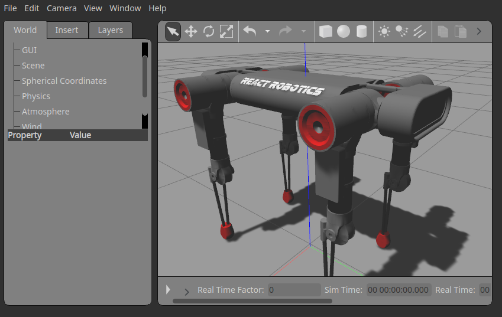
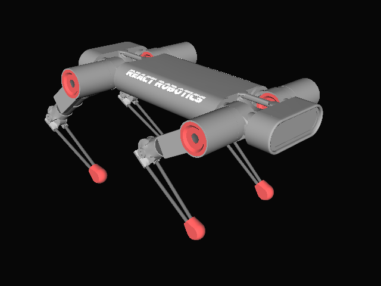

# Dogbot ROS Components

DogBot comes integrated with ROS for ease of integration with your own systems.  Refer to the main repo instructions for initial setup.

Currently the [URDF] and a simple Gazebo world are available for Dogbot v4.

# ROS/Gazebo operation

There is a standard [Catkin] workspace in the ROS folder, which should be built with `catkin build` starting in this folder (/ROS):

```bat
catkin build
source devel/setup.bash
```

## View Gazebo Simulation

To view the DogBot sim in an empty Gazebo world, starting with physics paused:
```bat
roslaunch dogbot_gazebo gztest.launch paused:=true
```


## View in RViz

To view the DogBot sim in RViz:

```bat
roslaunch dogbot_control dogbot_display.launch
```


## Operation and Controllers

12 controllers are instantiated, e.g. *front_right_knee_joint_controller*.  The [ros_control](http://wiki.ros.org/controller_manager) package is used to spawn and interact with ROS controllers.

## Control via Topics, examples

Show the current joint states: `rostopic echo -n 1 /dogbot/joint_states`

Sample output:
```bat
header: 
  seq: 275
  stamp: 
    secs: 5
    nsecs: 522000000
  frame_id: ''
name: [back_left_knee_joint, back_left_pitch_joint, back_left_roll_joint, back_right_knee_joint,
  back_right_pitch_joint, back_right_roll_joint, front_left_knee_joint, front_left_pitch_joint,
  front_left_roll_joint, front_right_knee_joint, front_right_pitch_joint, front_right_roll_joint]
position: [0.020000419605423758, 0.03960266958877945, -0.0021218398003215455, -0.020096095475635956, -0.03995880800641327, -0.0020628490909162522, 0.0200019894204555, 0.03961782316169771, 0.0016096084972598845, -0.02000122878676258, -0.039996863856661236, 0.001510764174433632]
velocity: [-0.00010527474898890457, -0.05999126541337438, 0.023494453417636632, 0.024105068535168438, 0.04700492130402434, 0.023240957414999482, -0.000596922913247722, -0.06022548838329635, -0.02402541894243887, 0.00034265343684009887, 0.0589492922375771, -0.02414196012983796]
effort: [-1.9987473232990993, -3.9632086186793813, 0.2159600645524229, 1.7079086119966114, 4.153585637851531, 0.2098364155584953, -1.9894945655073215, -3.969541821735767, -0.16152798434854176, 1.995826089237962, 4.006421853246422, -0.15152127120776626]
```

Show just back_left_roll_joint position: `rostopic echo -n 1 /dogbot/joint_states/position[2]`

Set a joint position: `rostopic pub /dogbot/back_left_knee_position_controller/command std_msgs/Float64 "data: -1.0" -1`

# URDF Standalone

The urdf and meshes to use outside of ROS or Gazebo are all under [dogbot_description](src/dogbot_description).  Note that the [dogbot.urdf](src/dogbot_description/urdf/dogbot.urdf) file defines the location of the meshes via their package locations.

URDF rendered in a DART simulation:


## Export URDF/SDF from Xacro

The xacro file is the golden source of DogBot's URDF definition, so if you wish to contribute please make your edits there.

The xacro file can be transformed to URDF or SDF using the following (note, [ROS] is required for this step):
```bat
cd src/dogbot_description/urdf
rosrun xacro xacro -o dogbot.urdf  dogbot.xacro
gz sdf -p dogbot.urdf  > dogbot.sdf
```

[URDF]: http://wiki.ros.org/urdf
[boilerplate]: https://github.com/davetcoleman/ros_control_boilerplate
[ROS]: http://www.ros.org
[Catkin]: https://catkin-tools.readthedocs.io/en/latest/index.html

# Licence

The DogBot URDF is published under [Creative Commons-Attribution (CC-BY)](https://creativecommons.org/licenses/by/4.0/)

